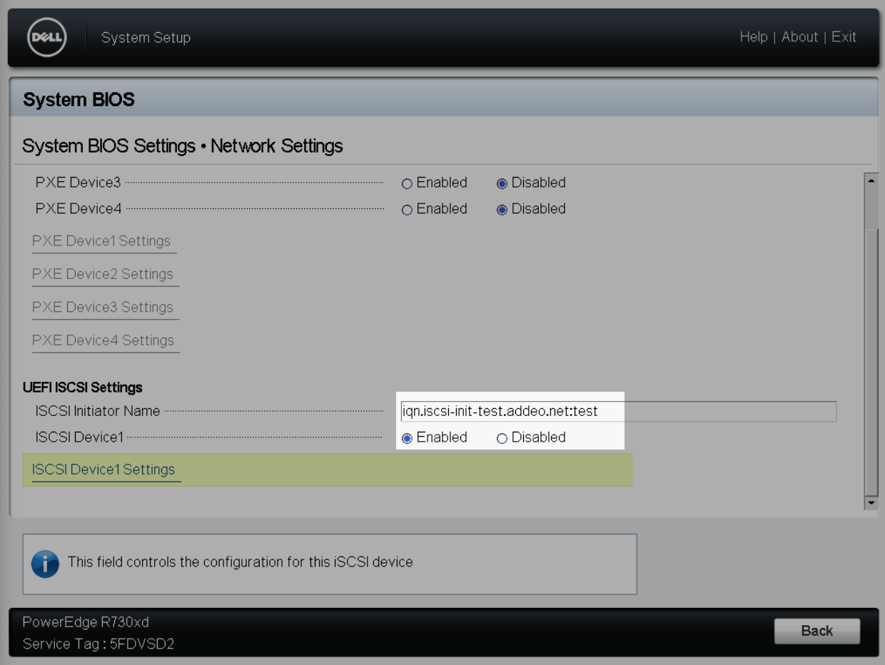
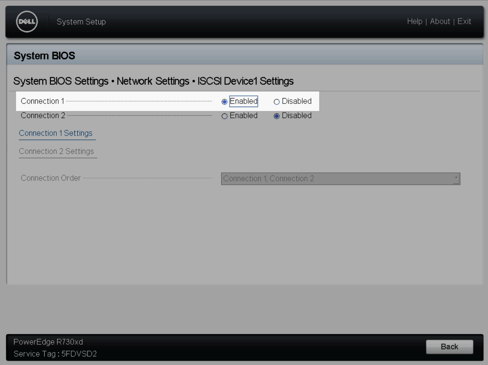
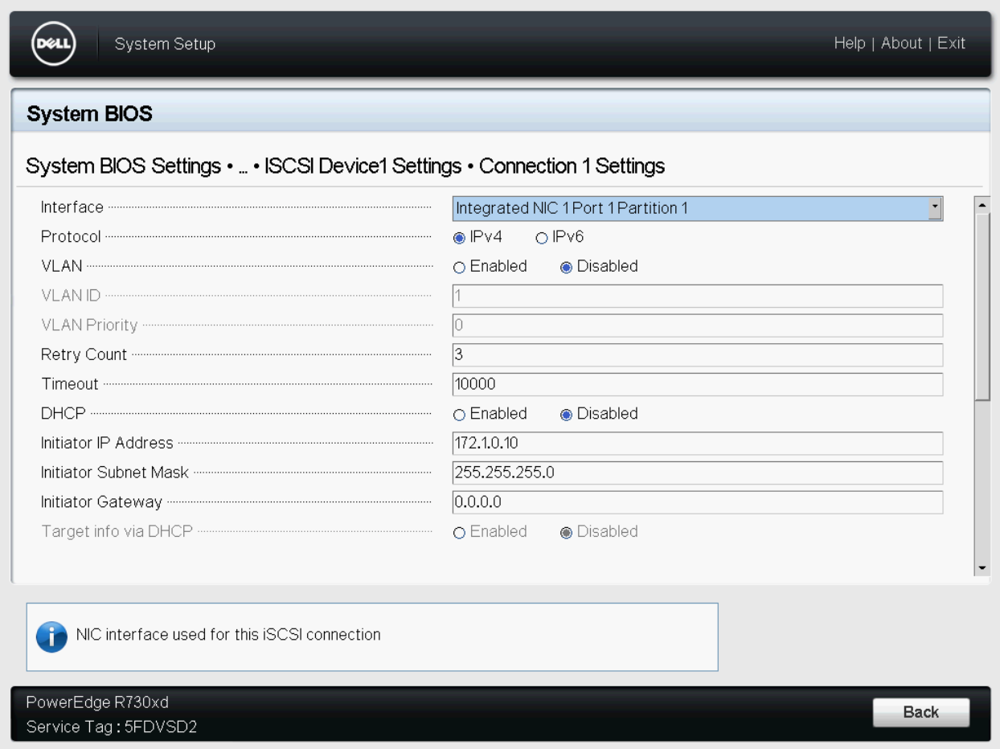
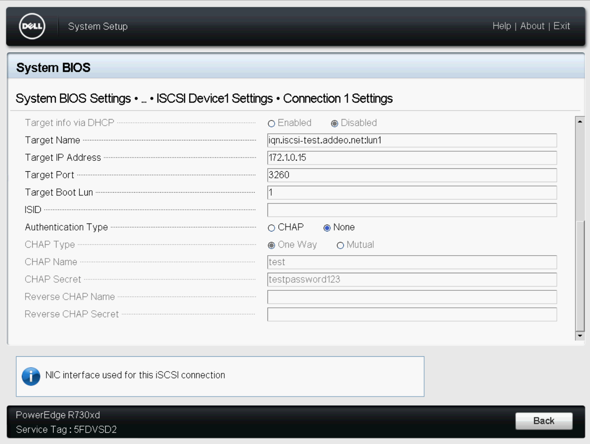

# Homelab Infrastructure

## Kubernetes

```console
### Provision Talos nodes & get kubeconfig
cd tofu
tofu apply
tofu output -raw kubeconfig > kubeconfig.yaml
KUBECONFIG=./kubeconfig.yaml:~/.kube/config kubectl config view --flatten > ~/.kube/config-new && mv ~/.kube/config{-new,}
rm kubeconfig.yaml
### Bootstrap flux and cluster infra
GITHUB_TOKEN="$(gh auth token)" flux bootstrap github --token-auth --owner=marcaddeo --repository=infrastructure --branch=master --path=../k8s/clusters/production --personal
```

## Ansible controller requirements

Currently using latest Ansible with `pipx` in order to get `ansible-lint` to
work:

```console
pipx install ansible
pipx inject --include-apps ansible ansible-lint netaddr jmespath
pip3 install ansible-merge-vars passlib --break-system-packages
```

**TODO:**

- [ ] Convert bootstrap to use <https://docs.zfsbootmenu.org/en/v2.3.x/guides/debian/bookworm-uefi.html>
- [ ] Fix dell-omsa role on Debian 12

## Merging variables

In order to easily be able to merge host specific variables with default
variables, we're using [ansible-merge-vars][]. We can use this the following
way:

### _group_vars/servers.yml_

```yaml
# Firewall Configuration.
servers_firewall_allowed_tcp_ports__to_merge:
  - 22
  - 25
```

### _host_vars/testbed.addeo.net.yml_

```yaml
# Firewall Configuration.
testbed_firewall_allowed_tcp_ports__to_merge:
  - 3260
```

### _server.yml_

```yaml
  # ...
  pre_tasks:
    - name: Merge firewall_allowed_tcp_ports
      merge_vars:
        suffix_to_merge: firewall_allowed_tcp_ports__to_merge
        merged_var_name: firewall_allowed_tcp_ports
        expected_type: list
  # ...
```

In this example we've got the default firewall configuration that applies to
all servers, and a host specific firewall configuration that extends the
default. To accomplish this we name our variables we intend to merge with the
following convention:

```text
<host or group name>_<final var name>__to_merge
```

Finally, we merge the variables into the final usable variable in the playbooks
`pre_tasks`.

## Bootstrap a Debian 12 Bookworm server with ZFS root

This setup is based on [this guide][] and will provision a Debian 12 Bookworm
server with ZFS root which is optionally encrypted, and optionally booted via
iSCSI.

### Notes

- The IP addresses used in the setup of the host should be the final desired
  static IPs for the host.

### Prepare the install environment

In order to provision a server with Debian 12 Bookworm with ZFS root first boot
to the live cd, and perform the following manual steps to prepare the
environment:

1. Configure network interfaces via `/etc/network/interfaces`. You'll need to
   configure the main interface with the desired static IP that will be used
   during and after bootstrapping.
2. (Optional) Configure the network interface used to boot from ISCSI, setting
   a static IP address that will be used during and after bootstrapping.
3. Open a terminal and run the following command:

```console
curl --proto "=https" --tlsv1.2 -sSf https://raw.githubusercontent.com/marcaddeo/infrastructure/refs/heads/master/prepare-install-environment.sh | sh
```

Now, using the static ip you can ssh into the server using the credentials
`root:live`.

### iSCSI Boot

In order to boot from an iSCSI target, we first need to manually configure the
live cd environment to be able to access the target and allow us to determine
the disk identifiers for the playbook.

```console
ip link set eno1 mtu 9000 # Enable jumbo frames on the SAN NIC
apt install --yes open-iscsi
systemctl start open-iscsi
iscsiadm -m discovery -t st -p <target host ip>
sed -i 's/node.startup = manual/node.startup = automatic/g' /etc/iscsi/nodes/<iscsi target id>/<ip info>/default # (tab complete this) e.g iqn.iscsi-test.addeo.net\:lun1/172.1.0.15\,3260\,1/default
systemctl restart open-iscsi
```

The servers BIOS will also need to be updated to configure booting from the
iSCSI target.

#### System BIOS Settings > Network Settings



#### System BIOS Settings > Network Settings > ISCSI Device1 Settings



#### System BIOS Settings > Network Settings > ISCSI Device1 Settings > Connection 1 Settings




### Configure the Ansible host

Create a new entry in the desired environments playbook and place the new host
in the `boostrap` group.

```ini
[bootstrap]
the.new.host.com ansible_host=10.1.15.65
```

If the hosts IP address has already been added to DNS, the
`ansible_host=10.1.15.65` variable can be omitted.

Next, create a `host_vars` file for the new host, e.g.
`host_vars/the.new.host.com.yml`.

Override any of the default bootstrap variables (`group_vars/bootstrap.yml`) to
configure the host how you like, e.g. enabling ZFS encryption on root, iSCSI
booting, etc.

#### Determine which disks will be used and their identifiers

Next, we need to determine which disks will be used for boot and root and put
their identifiers into the servers `host_vars` file. We can use `fdisk` and `ls
-l /dev/disk/by-id/*` to do so. We also need to define the pool type, which can
be: `single`, `mirror`, `raidz` ,`raidz2`, or `raidz3`. If using `raidzX`,
ensure you have the correct number of disks.

```yaml
zpool_type: mirror
zpool_disk_identifiers:
  - /dev/disk/by-id/scsi-0QEMU_QEMU_HARDDISK_drive-scsi0
  - /dev/disk/by-id/scsi-0QEMU_QEMU_HARDDISK_drive-scsi1
```

#### iSCSI Booting

If booting from iSCSI, you should use `ls -l /dev/disk/by-path/*` for the disk
identifiers:

```yaml
zpool_type: single
zpool_disk_identifiers:
  - /dev/disk/by-path/ip-172.1.0.15:3260-iscsi-iqn.iscsi-test.addeo.net:lun1-lun-1
```

#### Zap the partition table

After you've determined which disks you'll be using, you must manually zap the
partition tables:

```console
sgdisk --zap-all /dev/disk/by-id/<disk identifier>
# or
sgdisk --zap-all /dev/disk/by-path/<iscsi target disk path>
```

**_Note: This should be run for each disk_**

### Bootstrap the server

Finally, run through each playbook and you'll have a provisioned Debian server
with ZFS root. Two users will be created; `ansible` and `marc`. Their passwords
are `changeme` and should be changed immediately.

```console
ansible-playbook -i dev bootstrap/debian-zfs-root-part1.yml -e 'ansible_user=root ansible_ssh_pass=live' --ssh-common-args='-o userknownhostsfile=/dev/null'
ansible-playbook -i dev bootstrap/debian-zfs-root-part2.yml -e 'ansible_user=root ansible_ssh_pass=live' --ssh-common-args='-o userknownhostsfile=/dev/null'
ansible-playbook -i dev bootstrap/debian-zfs-root-part3.yml -e 'ansible_user=root ansible_ssh_pass=live' --ssh-common-args='-o userknownhostsfile=/dev/null'
```

## Rollback ZFS root

1. Load up a Live CD and run through the steps to prepare the live CD above
2. Install ZFS packages as in debian-zfs-root-part1
3. sudo zfs import -f rpool
4. sudo zfs rollback -rR rpool/root/debian@bootstrap
5. reboot
6. initramfs will come up, manually import with `zpool import -f rpool` because
   it was previously mounted on another system
7. `reboot -f -d 0`

no password necessary??

## Encrypted ZFS Datasets with Shavee

In this setup we're using Shavee to allow us to use a passphrase + YubiKey HMAC
for encrypted zfs datasets with MFA.

To add a new encrypted dataset, or decrypt an existing one, you will need to
physically be at the server.

```console
zfs create -o encryption=on -o keylocation=prompt -o keyformat=passphrase spool/data
# Enter a temporary encryption passphrase.
shavee -c -y 1 -z spool/data
# Enter real passphrase.
```

Next, add the new dataset to the `zfs_datasets` list on the appropriate
servers host_vars. All other properties of the dataset should be managed via
Ansible going forward.

```yaml
zfs_datasets:
  spool/data:
    properties:
      quota: 50G
      compression: lz4
      sharenfs: false
      # Encryption is enabled, but is manually managed.
      # encryption: true
    state: present
```

Finally, add the dataset to the list of shavee targets (replacing `/` with
`-`):

```yaml
shavee_encrypted_datasets:
  - spool-data
```

And re-run the server playbook:

```console
ansible-playbook -i dev server.yml -l <the server hostname> --tags=zfs,shavee
```

[this guide]: https://openzfs.github.io/openzfs-docs/Getting%20Started/Debian/Debian%20Bookworm%20Root%20on%20ZFS.html
[ansible-merge-vars]: https://github.com/leapfrogonline/ansible-merge-vars
